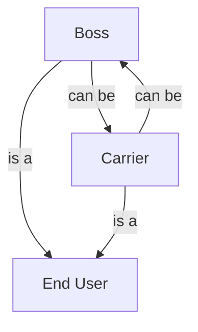

---

title: Tutorial
layout: page

---

## Tutorial for adelphos

Adelphos is a federated system in which users exchange goods and services
but they are *not* isolated, as in similar systems like eBay.

### Types of users

In adelphos users are grouped in families and families can form bigger
families, moreover families do not use external entities (like FedEx or
DHL), but rely on special members (called *carriers*) who will *route*
physically the object between families.

The family is able to gain credit using the exchange, either if it exports
the object and also if it imports it.

This poses the need for adelphos to have different roles in adelphos; in
this first version of adelphos we have three roles in a family

    - User

    - Boss

    - Carrier

As we can have a family of one member, Boss and Carrier are inclusive, that
is a user can be both a boss and a carrier for a certain family, but
conceptually they are different roles.

We could say:

As we have said before

Even the users in
adelpohos have the basic capability of exchaning goods and services.

This tutorial is intended by end users of Adelphos; 

not all the users in
adelphos have the same role, in the following part of the document the
three main roles of adelphos (boss, carrier and user)

There are three main
types of user in adelphos:

    -

